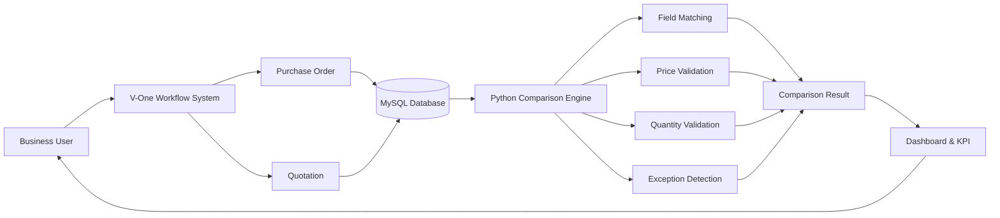

# System Architecture

```mermaid
flowchart LR

U[Business User]

U --> V[V-One Workflow System]

V --> P[Purchase Order]
V --> Q[Quotation]

P --> DB[(MySQL Database)]
Q --> DB

DB --> PY[Python Comparison Engine]

PY --> C1[Field Matching]
PY --> C2[Price Validation]
PY --> C3[Quantity Validation]
PY --> C4[Exception Detection]

C1 --> R[Comparison Result]
C2 --> R
C3 --> R
C4 --> R

R --> D[Dashboard & KPI]
D --> U
```
